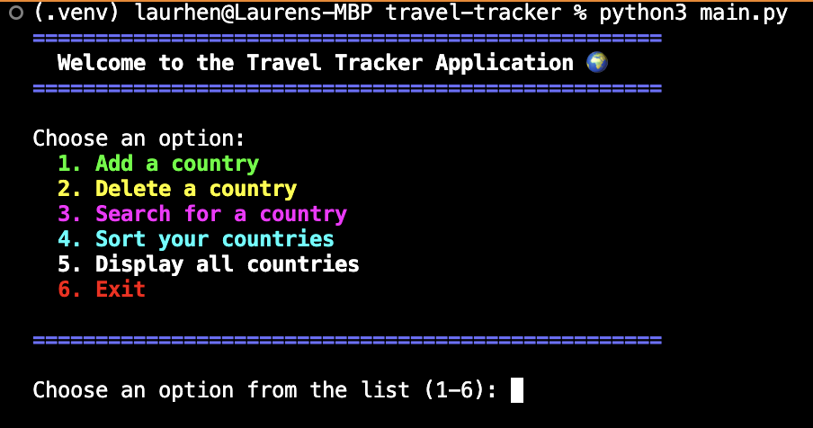
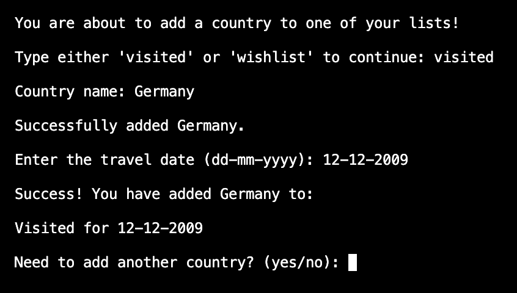
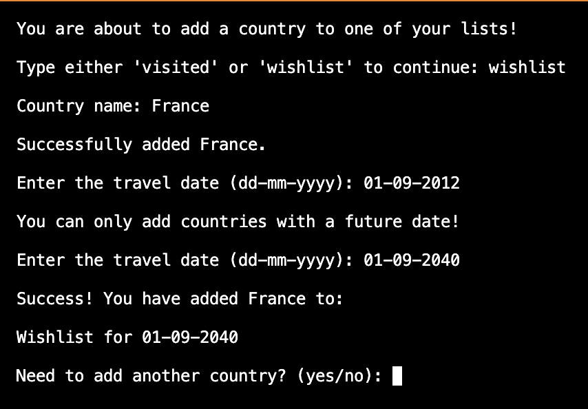
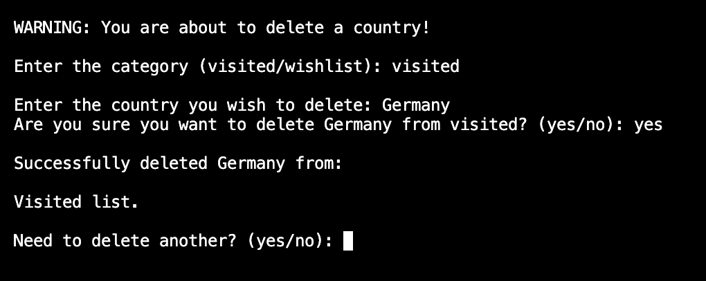
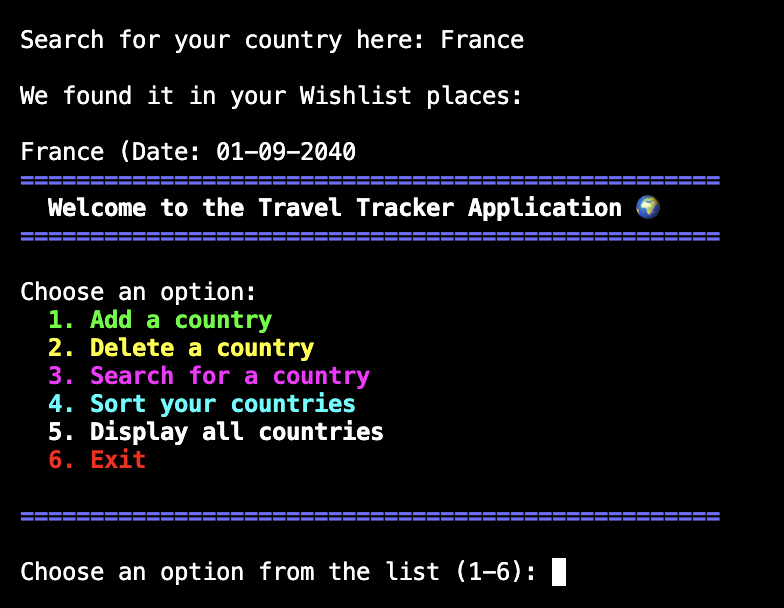
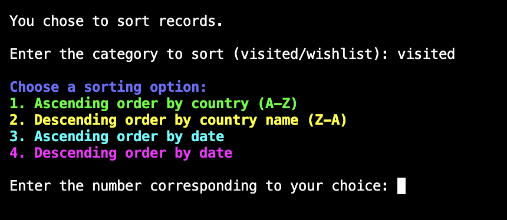
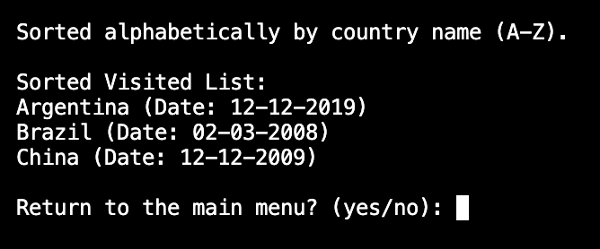
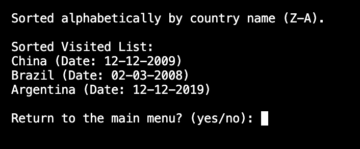
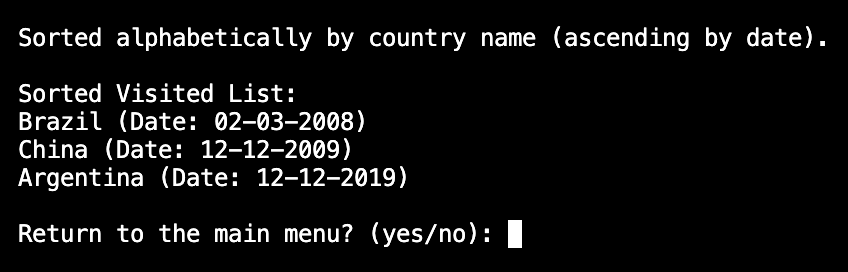

# Travel Tracker Application

## Overview

The Travel Tracker Application is an interactive tool designed to help users manage and organize their travel experiences. With this app, users can keep track of the countries they have visited and the destinations they wish to visit in the future. 

### Key Features:
- **Add a Country**: Add countries to either the "visited" or "wishlist" categories, along with additional details like travel dates and age (if applicable).  
- **Delete a Country**: Remove entries from your "visited" or "wishlist" lists with confirmation for safe deletion.  
- **Search for a Country**: Quickly locate specific countries in your records.  
- **Sort Countries**: Organise your country lists alphabetically or by date for easier navigation.  
- **Display All Countries**: View a comprehensive list of all your recorded countries in both categories.  
- **Input Validation**: Ensures all data, such as country names, ages, and travel dates, meet predefined criteria for accuracy and consistency.

This user-friendly application is perfect for travel enthusiasts who want to keep track of their past adventures and future aspirations in a simple and efficient way.

### Languages & Tools
- [ Jupyter Notebook using Python](https://en.wikipedia.org/wiki/Python_(programming_language))
   - Python 3.16.2 was used to build the entire application through Jupyter Notebook
- [Lucid Flowchart](https://www.lucidchart.com/pages/)
     - Lucid Flowchart was used to map the logic of the Mad Libs game during the initial design process.
- [Git](https://git-scm.com/)
    - Git was used for version control via GitPod, by using the terminal to Git and Push to GitHub.
- [GitHub](https://github.com/)
    - GitHub was used to store the project code after being created in GitPod/Git.
- [Gitpod](https://www.gitpod.io/)
    - Gitpod was used to create, edit and preview the project's code.

#### Installation

There is no formal installation required to use the application. Just follow these steps:

1. Clone or download the script from the repository:
   - Clone: `git clone https://github.com/your-repository/travel-tracker.git`
   - Or download the ZIP file and extract it.

2. Navigate to the project directory:
   - `cd travel-tracker`

3. Ensure that Python is installed on your machine.

4. Run the script using Python:
   - `python3 main.py`

## Features

### Existing Features

#### Display Menu
- When the user first starts the application, they will be presented with a display menu. This menu displays all of the options to start their travel journey (see below). The user needs to enter a number between 1-6 to start the application. 

Screenshots

_Display Menu_

#### Add a Country:
- When prompted, the user enters 1, and is then allowed to enter the country they want to add to their "visited" or "wishlist" category.
- They will also need to input their age if adding to the "visited" category for the first time.
- The application will validate the entered country, age (if applicable), and travel date.
- The date format should be in `dd-mm-yyyy`.

Screenshots

_Add a visited country_

_Add a wishlist country_

### Delete a Country:
- The user can remove a country from either their "visited" or "wishlist" list by entering the country name.
- A confirmation will be requested to ensure the correct deletion.
- The user can also return back to the main menu or continue deleting more countries. 

Screenshots

Delete a country_

### Search for a Country:
- Once they have added some countries, the user can search for a country in their records. If it is not found, they can choose to add it to their lists.

Screenshots

Search for a country_

### Sort Countries:
- If the user selects 4, this feature will allow them to organize the countries in their lists alphabetically.
- They have four options: alphabetically (A-Z), alphabetically (Z-A), by date (oldest to most recent) or by date (most recent to oldest).

Screenshots

_Sort menu

_Sort A-Z_

_Sort Z-A_

_Sort by date_

### Display All Countries:
- If the user selects 5, they can view the entire list of countries in both the "visited" and "wishlist" categories.

Screenshots

_Display all countries_

### Exit:
- If the use selects 6, they will exit the application when done and be shown a success message.
- They can also exit the application after completing other tasks and will be prompted to do so. 

Screenshots

_Exit the application_

## Input Validations

- **Country**: The application validates the country against a predefined list of valid countries. If the entered country is not on the list, the user will be prompted to re-enter it.
- **Age**: The application asks for the user's age when adding a country to the "visited" list for the first time. The age must be a number between 1 and 120. This ensures that the user does not enter an impossible age, such as a negative number (below 0) or above 120.
- **Date**: The travel date must be entered in the `dd-mm-yyyy` format. The application also ensures that:
  - For "visited" countries, the date *cannot* be in the future.
  - For "wishlist" countries, the date *must* be in the future.

Screenshots

_Validation messages_

### Future Features

#### Integration with Maps API
   - **Feature**: Display countries on an interactive map using APIs like Google Maps or OpenStreetMap.  
   - **Challenge**: API integration and dynamic map rendering require internet connectivity and external modules, which were outside the project's constraints.

#### Data Storage
   - **Feature**: Save travel records to a database or file (e.g., SQLite or CSV) for long-term storage and retrieval between sessions.  
   - **Challenge**: Implementing this feature would require integrating external libraries or frameworks, which was beyond the scope of this project.

## Testing

To ensure the application was working correctly and followed best practices, thorough testing was performed, including:

### User Testing

The application has been manually tested to validate each user story, ensuring the following functionalities work as expected:
- Adding, deleting, searching, and sorting countries.
- Proper input validation for countries, ages, and travel dates.
- User-friendly interactions via the terminal.

| **Test Case**                 | **Description**                                                  | **Expected Result**                                                                 | **Outcome**           | **Status**   |
|-------------------------------|------------------------------------------------------------------|------------------------------------------------------------------------------------|-----------------------|--------------|
| Add a country to "visited"    | User adds a valid country to the "visited" list.                | Country is added with valid age and date, displayed in the "visited" list.         | Functioned as expected | ✅ Passed    |
| Add a country to "wishlist"   | User adds a valid country to the "wishlist" list.               | Country is added with a valid future date, displayed in the "wishlist" list.       | Functioned as expected | ✅ Passed    |
| Delete a country              | User deletes a country from either "visited" or "wishlist."     | Country is removed after confirmation and no longer displayed in the respective list. | Functioned as expected | ✅ Passed    |
| Search for a country          | User searches for a country in the lists.                      | If found, the country and its details are displayed; otherwise, prompted to add it. | Functioned as expected | ✅ Passed    |
| Sort countries                | User sorts the lists alphabetically.                           | Countries in both "visited" and "wishlist" lists are sorted correctly.             | Functioned as expected | ✅ Passed    |
| Input validation (countries)  | User enters an invalid or unrecognized country.                | Application rejects the input and prompts the user to re-enter a valid country.    | Functioned as expected | ✅ Passed    |
| Input validation (ages)       | User enters an invalid age (e.g., non-numeric or out of range).| Application rejects the input and prompts the user to enter a valid age.          | Functioned as expected | ✅ Passed    |
| Input validation (dates)      | User enters an invalid date format or inappropriate date.      | Application rejects the input and prompts the user to enter a valid date.          | Functioned as expected | ✅ Passed    |
| Exit application              | User exits the application via the menu.                      | Application terminates gracefully without errors.                                  | Functioned as expected | ✅ Passed    |

All test cases have been thoroughly validated, ensuring a seamless and reliable user experience.

### Pylint
The code was analyzed using **Pylint** to check for any coding standard violations, errors, or warnings. Pylint ensures that the code follows the PEP 8 guidelines and is maintainable. Majority of the errors were dealt with and resolved. The remainder can be justified as per below:

#### Justification for Remaining Code Issues

While the application has been thoroughly tested and reviewed for code quality, the following warnings/errors were left unresolved due to specific constraints or design decisions:

| **Error/Warning**                               | **Description**                                                                                         | **Justification**                                                                                 |
|-------------------------------------------------|---------------------------------------------------------------------------------------------------------|---------------------------------------------------------------------------------------------------|
| `W0603: Using the global statement (global-statement)` | A `global` statement was used to share variables across functions.                                      | This was a necessary design choice to maintain simplicity and ensure ease of data sharing in a pure Python script. Using alternative solutions, such as refactoring into classes, was not feasible within the scope of the project. |
| `R1724: Unnecessary "else" after "continue"`    | The "else" block after a "continue" statement is redundant and can be removed.                         | The current structure improves readability by clearly separating conditional branches. While not optimal, it aligns with the educational context of the project. |
| `R1723: Unnecessary "elif" after "break"`       | The "elif" block following a "break" statement is redundant and can be simplified.                     | This structure was retained to enhance clarity, particularly for users unfamiliar with nested conditionals, as clarity was prioritized over adherence to this specific rule. |
| `R0912: Too many branches (14/12)`              | The function exceeds the recommended number of branches (12).                                           | Refactoring to reduce branches would have introduced unnecessary complexity or disrupted the logical flow. Given the educational context, maintaining readability and simplicity for new programmers was a priority. |

The above issues were acknowledged during the development process, and their inclusion is deliberate. The design choices were made to prioritize:
- Readability and clarity for users with varying levels of programming experience.
- Adherence to pure Python and Jupyter Notebook constraints, which limited advanced structural refactoring options.
- Focus on functionality and user experience within the scope of the project.

These issues can be addressed in future iterations by incorporating modular design patterns, object-oriented programming, or external libraries, which were beyond the current project's scope.

### Flake8
**Flake8** was used to check the Python code for compliance with style guides and to detect any errors or inconsistencies in the code structure. No errors remain in the code.

The testing process confirmed that the following aspects were thoroughly covered:
- Functional requirements of the application.
- Input validation and edge cases.
- Code readability and consistency with the help of Pylint and Flake8.

Screenshots

_Flake8 results showing no errors_

## Conclusion

The Travel Tracker Application provides a simple, interactive way to manage and track travel experiences. Its user-friendly interface and robust validation ensure that users can maintain accurate records of the countries they have visited or wish to visit. The app is easily extensible, allowing developers to add features like data persistence or improved sorting and filtering options.

